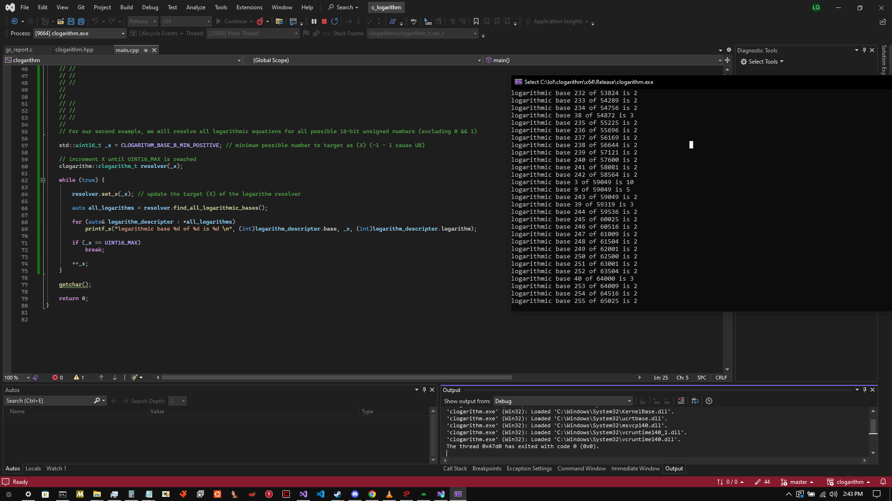

# clogarithm

## What is clogarithm? 

clogarithm is A light-weight, cross-platform, header-only C++ library used to resolve all possible logarithmic expressions resulting in the Target value (x).

I wrote this with the sole intention of using it for a cryptographic algorithm i am writing, however decided it could be worth a standalone release to potentially save someone else time if they ever require 
this niche functionality.

--------------------------------------------------------------------------------------------------------------------------------------------------------------------------------------------------------------

## What is a logarithm? 
A logarithm is the inverse function to exponentiation, or the exponent to which a base number must be raised, in order to evaluate to a given value.

for example if i want the logarithmic base 10 (b) of 1000 (x)

10², or ( 10 * 10 ) = 100                           
10³, or ( 10 * 10 ) * 10 = 1000

In the above example, 3 is the logarithmic base 10 of 1000 .

--------------------------------------------------------------------------------------------------------------------------------------------------------------------------------------------------------------

## Setup

Simply drag clogarithm.hpp into your CXX project and be sure to import the header: 

```cpp
#include "/path/to/clogarithm.h" // include c_logarithm.hpp
```

--------------------------------------------------------------------------------------------------------------------------------------------------------------------------------------------------------------

## Example usage

The library is fairly straight-forward to use and manages memory usage automatically, with very few functions or setup needed.

```cpp
#include "clogarithm.h" // include c_logarithm.hpp

int main() {

  intptr_t x = 1000000; // the target number to resolve logarithmic base(s) for

  clogarithm::clogarithm_t logarithm_resolver(x); // instantiate the clogarithm object

  auto all_logarithms = logarithm_resolver.find_all_logarithmic_bases(); // resolve all logarithmic base(s) of x

  for (auto& i : *all_logarithms) // this will output: " base: 10, logarithmic exponent: 6 \n base: 100, logarithmic exponent: 3 \n base: 1000, logarithmic exponent: 2" 
    printf("base: %d, logarithmic exponent: %d\n", (int) i.base, (int) i.logarithm); // clogarithm_entry_t.base is the base of x which we are resolving the logarithmic base of, the logarithmic base of [base] is stored in clogarithm_entry_t.logarithm

  logarithm_resolver.clear_logarithm_engine(); // this needs to be called if you wish to begin searching for logarithms again through the same object after calling find_all_logarithmic_bases()

  //If you wanted to change the number being resolved for, you can call logarithm_resolver.set_x( <value> ) at any time;

  auto& first_logarithm = logarithm_resolver.find_next_logarithmic_base(); // find the lowest logarithmic base (iterator) of (x = 1000000 in our case)  

  if (first_logarithm.valid) // did we find a logarithm?
    printf("base: %d, logarithmic exponent: %d\n", (int)first_logarithm.base, (int)first_logarithm.logarithm); // this code will execute and print: " base: 10, logarithmic exponent: 6 "
  else
    printf("%s", "no logarithmic bases found!\n \n");

  
}

getchar();

return 0;
}
```

### And an image of the output: 


